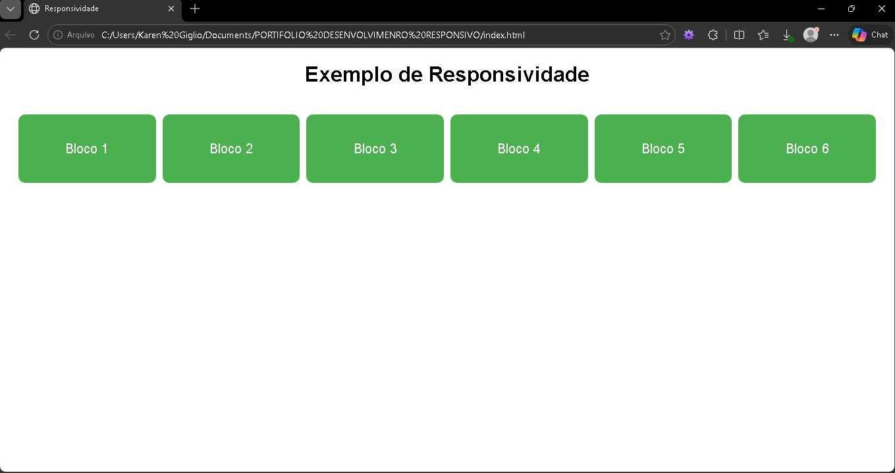
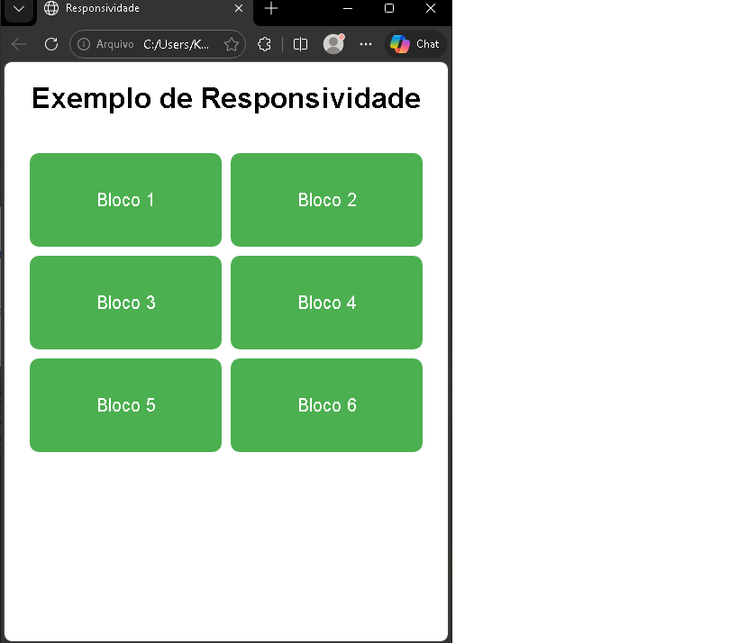

# Projeto de Responsividade

Este projeto foi desenvolvido com o objetivo de aplicar conceitos de responsividade em páginas web, utilizando HTML e CSS.

## Tecnologias utilizadas
- HTML
- CSS
- Media Queries

## Funcionalidades

A página se adapta automaticamente a diferentes tamanhos de tela:

- Desktop: 6 colunas
- Tablet: 3 colunas
- Tela média: 2 colunas
- Mobile: 1 coluna

## Demonstração

### Versão Desktop

### Versão Mobile

##  Aprendizados

Durante o desenvolvimento, foi possível compreender na prática como funcionam as Media Queries e a importância da responsividade para a experiência do usuário.

## Autora

Karen Andressa Giglio
